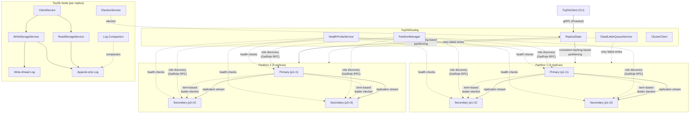

# ToyDb

Toy database for learning the fundamentals on database implementation and data management.

## Architecture

The database is currently a simple key-value store which receives commands using gRPC.

- [ToyDb](./ToyDb/) - Database server source code
- [ToyDbClient](./ToyDbClient/) - Database client source code
- [ToyDbRouting](./ToyDbRouting/) - Database routing layer
- [ToyDbContracts](./ToyDbContracts/) - Definitions of the protobuf messages accepted by the database

## Learning objectives

The learning outcomes from this work are heavily inspired by different chapters from [Designing Data Intensive Applications](https://www.amazon.com.au/Designing-Data-Intensive-Applications-Reliable-Maintainable/dp/1449373321) by Martin Kleppmann.

The current capabilities we aim to explore are:

- Data storage and retrieval
- Data encoding
- Partitioning
- Replication
- Transactions
- Distributed hosting

## Usage

### Prerequisites

- Generate HTTPS certificate:
  - `dotnet dev-certs https --trust -ep "./certs/aspnetapp.pfx" -p password`
  - If that doesn't work, try this `dotnet dev-certs https --trust --export-path certs/aspnetapp.crt`

### Via client

- Run the server via `dotnet run --project .\ToyDb\ToyDb.csproj -lp https`
  - **Note:** must be run via HTTPS for Protobuf communication to work
- Run the client via:
  - Get value: `dotnet run --project .\ToyDbClient\ToyDbClient.csproj -- get Hello`
  - Set value: `dotnet run --project .\ToyDbClient\ToyDbClient.csproj -- set Hello=World`

## Design decisions

### Protocol

- ToyDb uses Google Remote Procedure Calls (gRPC) to communicate between clients and the database with messages defined using Protobufs. This allows for efficient communication, however, this could be problematic if we need to support .NET AoT in the future (not sure there's AoT gRPC support).

### Encoding

- ToyDb uses binary encoding of data to when saving to disk for efficient writes and reads. Values are currently Base64 encoded for no specific reason. This it might be something we want to remove as it will likely complicate value searching in the future.

### Disk storage

- When writing to disk, ToyDb stores keys and their values to two places; a Write-Ahead Log, used for auditing and potentially in the future data recovery if needed, as well as an active Append-only Log (AoL). The active log is used for reads and goes through a compaction process to remove data redundancies at regular intervals to ensure reads remain efficient. The compaction process will produce a new AoL which in turn will be used for subsequent writes.

### Concurrent writes

- To ensure that there is no data loss during writes, a write process must obtain a lock on the AoL before appending the key-value pair. To avoid issues in lock contention between concurrent writes and system processes such as log compaction,the writes for each partition are queued and applied sequentially. This has the added benefit of ensuring writes occur in order, however it comes at a potential performance cost, since writes can now only be parallelized on a partition-basis.

### Routing layer

- A routing layer manages partition access and replication management. This simplifies client integration by keeping the client agnostic to the nodes that comprise the underlying database. It should also make node failover simpler by providing an orchestration layer without the need for node consensus.
- There is a risk where the routing layer becomes the single point of failure. This can hopefully be overcome by provisioning multiple routing instances to fallback to in the case of failure.

### Partitioning

- ToyDb uses consistent hashing to assign keys to partitions. This ensures that values are uniformly distributed and minimizes data reshuffling when partitions are added or removed from the cluster. Virtual nodes are used to further improve distribution balance.
- The routing layer is responsible for determine the partition a key-value is assigned to. This keeps the client agnostic of the underlying cluster topology.

### Replication

- ToyDb uses leader replication, where a primary replica handles writes and secondary replicas handle reads. The use of a leader for writes helps prevent write concurrency and ordering issues. The delegation of write and read requests to replicas is handled by the client based on specified configuration.
- Writes are asynchronously propagated to all secondary replicas via replication log streaming. The number of replicas who respond is a configurable threshold. Higher thresholds result in higher data consistency across replicas at the cost of higher write latency. Lower thresholds result in lower write latency at the cost of data consistency across replicas. This is a trade-off to be determined by users.
- In case of write failures, ToyDb has a configurable retry policy. The configuration of these retries is determined by the needs of the user. Primary write retries ensure higher reliability at the cost of latency, while secondary write retries ensure better replica consistency at the cost of latency.

### Secondary Catch-Up

- When a secondary replica restarts or comes online after being offline, it automatically syncs missed writes from its partition's primary via the replication log stream. This ensures the secondary remains consistent with the primary after being offline.
- On startup, the secondary compares its local LSN with the primary's and pulls any missing entries. Catch-up failures are logged but do not prevent the node from starting.

### Leader Election

- ToyDb uses term-based leader election for automatic failover. Nodes track a monotonically increasing term number, and when a secondary detects primary failure (via replication stream disconnect or health probe timeout), it initiates an election.
- The secondary with the highest last-applied LSN wins the election (most up-to-date data takes priority). Ties are broken by node ID lexicographic order.
- A majority of 2 out of 3 replicas is required to win an election, allowing failover even when one node is down.
- The elected node transitions to primary and begins accepting writes; losers remain secondaries and connect to the new primary's replication stream. 
